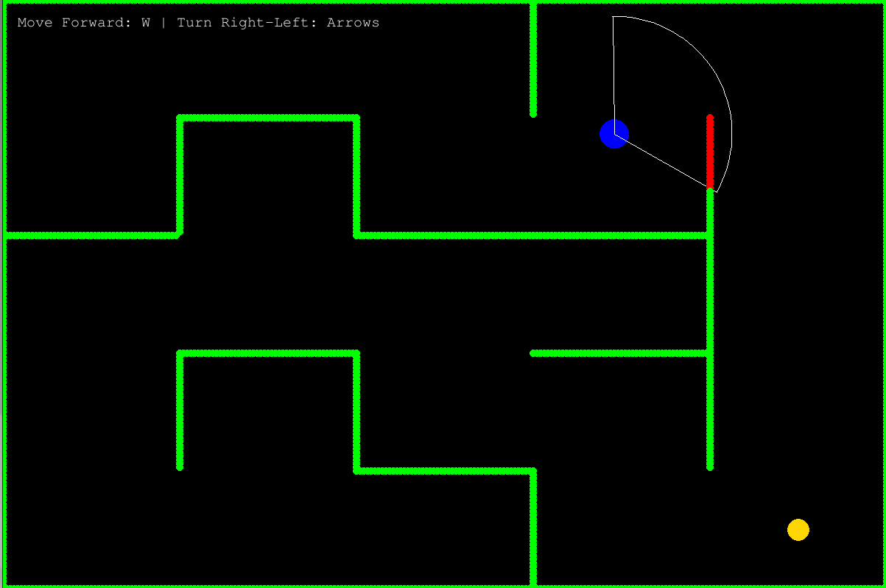

# IntroEventTUMaster

This is a demo project for the Introductory week of TU Berlin, directed at master students.

## Rules

Navigate the player (blue) through a maze using only audio cues. The game is won if the target (yellow)
is reached. The game is lost if the player collides with a wall. This game is supposed to be played blindfolded.
Use headphones to get acoustic feedback regarding the player's surroundings.

## Dependencies
- pygame
- numpy

## Usage
Just run main.py
